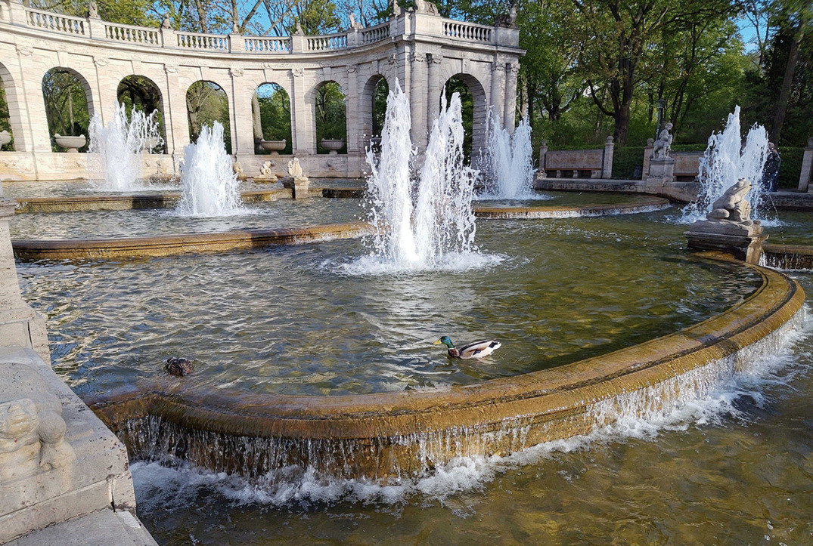

Mitte April 2026, in Berlin an einem Tag, der erst noch ganz grau und
verhangen war, aber dann über Mittag doch noch zu bestem Frühlingswetter
wechselte. Ein Teil der LIBREAS-Redaktion – der, der gerade in der Stadt
sein kann – trifft sich in einem der Parks. Sicherlich: Der Park ist
irgendwie schon zu voll. Die Grillwiese ist praktisch komplett besetzt.
Menschen spielen dort Frisbee, wo andere Menschen durchgehen wollen. Die
Schlangen vor dem Imbiss sind zu lang (aber zum Glück noch nicht die in
den umliegenden Spätis). Auf dem Hügel im Park finden wir aber doch
einen Platz, auf einer der dort neu gebauten Bänke mit Blick über die
Bäume, die Häuser hinweg in den weiten Horizont. Später dann wechseln
wir auf eine Bank am Brunnen des Parks, der heute besser gepflegt ist,
als es noch vor einigen Jahren der Fall war.

Was wir hier tun, ist vor allem miteinander zu reden. An sich geht es um
das Soziale, aber selbstverständlich geht es auch immer wieder um die
Zeitschrift. Um Dinge, die wir gerne in Zukunft umsetzen wollen, um
Dinge, die bislang nicht so geklappt haben. Um all das. Grundsätzlich
ist es positiv. Sicherlich: Wir wissen auch, dass die Welt sich gerade
nicht nur zum Guten entwickelt, dass es vielen Menschen viel schlechter
geht als uns hier: Kriege, Book Bans, Sparmaßnahmen. Es fällt leicht,
solche Punkte aufzuzählen. Aber was hier doch überwiegt: Das gemeinsame
Gespräch, der Frühling, die Dinge, die dann neu werden, die aufblühende
Natur, die Enten im Brunnen, vermitteln Positives. Bei all dem, was
falsch läuft, was besser werden muss – das Gespräch miteinander hilft
uns auch, einen ruhigen Blick auf die Zukunft zu gewinnen.

Sicherlich, diese Grundstimmung passt gerade gut auf die Zeitschrift:
Wir haben mehrfach verkündet, dass sich intern einiges ändert. (Und, um
daran zu erinnern: Wir sind weiterhin auf der Suche nach Personen, die
in der Redaktion mitarbeiten wollen.[^1]) Aber es scheint uns auch, dass
wir diese Veränderungen gut meistern.

Und das passt auch auf unsere neue Ausgabe. Das Schwerpunktthema
"Interviews" wird von einer ganzen Reihe von Gesprächen aufgegriffen,
die tatsächlich, so wie wir gehofft haben, mit sehr verschiedenen
Personen aus dem Bibliothekswesen geführt wurden. Neuen Direktor\*innen,
alten und aktuellen Mitgliedern von Redaktionen, Professor\*innen,
Bibliothekar\*innen. (Wer wieder einmal fehlt, sind Nutzer\*innen von
Bibliotheken. Aber vielleicht wäre das ja ein Thema für eine spätere
Ausgabe.) Zudem erreichten uns einige Beiträge, welche die Methode des
Interviews reflektieren. In den Beiträgen außerhalb des Schwerpunktes
geht es wieder einmal (was wir begrüßen) um Projekte im Rahmen
des Wikiversums und sowie (was auch ein wichtiges Thema ist, obgleich man
sich immer wünscht, dass es nicht in der eigenen Einrichtung relevant
wird) um Schädlinge, also Insekten vor dem Hintergrund des Klimawandels.

Mit Hoffnung auf ein besseres Morgen und einen Verweis auf den laufenden
Call für die Ausgabe #49 zum Schwerpunkt "Genuss --- Essen, Trinken,
Schlafen in der Bibliothek"[^2] verbleiben wir mit Wünschen für eine
angenehme Lektüre.

Redaktion LIBREAS

(Berlin, Brandenburg an der Havel, Chur, Göttingen, Karlsruhe und
München)

[^1]: Call für Mitglieder der LIBREAS-Redaktion und des
    LIBREAS-Vereinsvorstandes, 08.01.2026,
    [https://libreas.wordpress.com/2026/01/08/call-fur-mitglieder-der-libreas-redaktion-und-des-libreas-vereinsvorstandes/](https://libreas.wordpress.com/2026/01/08/call-fur-mitglieder-der-libreas-redaktion-und-des-libreas-vereinsvorstandes/)

[^2]: CFP #49: Genuss --- Essen, Trinken, Schlafen in der Bibliothek,
    14.04.2026,
    [https://libreas.wordpress.com/2026/04/14/cfp-49-genuss-essen-trinken-schlafen-in-der-bibliothek/](https://libreas.wordpress.com/2026/04/14/cfp-49-genuss-essen-trinken-schlafen-in-der-bibliothek/)
